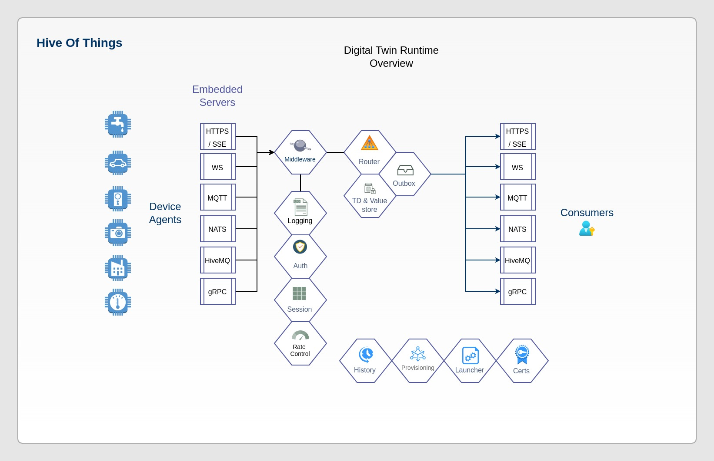

# Hive-Of-Things Hub

HiveOT stands for the "Hive of Things". It consists of one or more 'Hubs' to collect and share IoT data with its users.

The Hub for the *Hive-of-Things* provides a secure [runtime](runtime/README-runtime.md) to view and control IoT devices. The Hub securely mediates between IoT device 'Things', services, and users using a hub-and-spokes architecture. Users interact with Things via the Hub's digital twin, without connecting directly to the IoT devices or services. The Hub is based on the [W3C WoT TD 1.1 specification](https://www.w3.org/TR/wot-thing-description11/). Multiple communication protocols are supported for IoT devices and users.


## Project Status

Status: The Hub core is currently being reworked to use the "[digital twins runtime](runtime/README-runtime.md)" with multiple concurrent protocol support. (May 2024). 

TODO before alpha:
1. ~~Implement digitwin runtime in golang~~
2. ~~generate golang api's from TD definitions (tdd2go)~~
3. javascript hubclient with SSE callback channel (for use by zwavejs)
4. Rework existing IoT bindings to work with the digital twin runtime
   * ~~1-wire protocol binding using owserver-v2 gateway (bindings/owserver)~~
   * insteon binding using isy99x gateway (bindings/isy99x)
   * ipnet network scanner
   * zwave protocol binding using zwavejs (bindings/zwavejs)
5. Minimal web client  (bindings/hiveoview)
   * ~~directory viewer~~
   * ~~configuration editing~~
   * dashboard 
   * admin panel for managing users and devices; starting/stopping of services
6. Support for Forms sections in TDD documents describing the protocols to interact with a Thing.
7. improve the https protocol binding
   * ~~support subscribing to Thing events~~ 
   * ~~Integrate role authorization (viewer, operator, manager, admin)~~
   * Support client certificate authentication
   * Support websockets as return channel
   * Support UDS for local services
8. improve the embedded protocol binding (for internal services) 
   * improve subscription support to reduce traffic/processing
9. Revisit the vocabulary to integrate or adopt existing vocabularies where possible
10. Javascript tdd2js client api generator
11. Python tdd2py client api generator

Future Roadmap:
1. rework mqtt transport protocol
1. rework the nats transport protocol
1. support Action queues for delayed delivery to offline agents


Integrations

It is a bit early to look at integrations, but some interesting candidates are:
* plc4go (https://plc4x.apache.org/users/getting-started/plc4go.html)
* home assistant (https://www.home-assistant.io/)

## Audience

This project is aimed at software developers and system implementors that are working on secure IoT solutions. HiveOT users subscribe to the security mandate that IoT devices should be isolated from the internet and end-users should not have direct access to IoT devices. Instead, all access operates via the Hub.

## About HiveOT

Security is big concern with today's IoT devices. The Internet of Things contains billions of devices that when not properly secured can be hacked. Unfortunately the reality is that the security of many of these devices leaves a lot to be desired. Many devices are vulnerable to attacks and are never upgraded with security patches. This problem is only going to get worse as more IoT devices are coming to market. Imagine a botnet of a billion devices on the Internet ready for use by unscrupulous actors.

The 'HiveOT Hub' provides capabilities to securely interact with IoT devices and consumers. This includes certificate management, authentication, authorization, provisioning, directory and history services.

HiveOT compatible IoT devices therefore do not need to implement these features. This improves security as IoT devices do not run Web servers and are not directly accessible. They can remain isolated from the wider network and only require an outgoing connection to the Hub. This in turn reduces required device resources such as memory and CPU (and cost). An additional benefit is that consumers receive a consistent user experience independent of the IoT device provider as all interaction takes place via the Hub interface.

HiveOT is based on the [W3C WoT TD 1.1 specification](https://www.w3.org/TR/wot-thing-description11/) for interaction between IoT devices and consumers. It aims to be compatible with this standard. See [docs/README-TD.md] for more information.

Integration with 3rd party IoT devices is supported through the use of IoT protocol bindings. These protocol bindings translate between the 3rd IoT protocol and WoT defined action and event messages.

The Hub supports multiple transport protocols, such as HTTPS/SSE, WebSocket, NATS, and MQTT message bus protocols through embedded servers. (under development)

Last but not least, the 'hive' can be expanded by connecting multiple hubs to each other through a 'bridge'. The bridge lets the Hub owner share select IoT information with other hubs. (future feature)



## Build From Source

To build the hub and plugins from source, a Linux system with golang 1.21 or newer must be available for the target system. To build zwavejs nodejs is used. hivoview is golang based and does not require any additional build tools. All builds can be done by running make.

Prerequisites:

1. An x86 or arm based Linux system. Ubuntu, Debian, Raspberrian
2. Golang 1.21 or newer (with GOPATH set)
3. GCC Make any 2020+ version
5. nodejs v18+ (for building zwavejs)

### Build Hub And CLI

1. Download source code:

```sh
git clone git@github.com:hiveot/hub
cd hub
``` 

2. Build the hub

```sh
make all
```

After the build is successful, the distribution files can be found in the 'dist' folder that can be deployed to the installation directory.

```md
dist / bin - core application binaries (runtime, launcher and hubcli)
dist / plugins - plugin binaries
dist / certs - CA and server certificate; authentication keys and tokens
dist / config - core and plugin configuration files
dist / stores - plugin data storage directory
```

## Install To User (Easiest)

When installed to user, the hub is installed into a user's bin directory and runs under that user's permissions.

This is the simplest way to install and run hiveot.

For example, for a user named 'hub' the installation home is '/home/hub/bin/hiveot'.

To build and install from source, run
> make all && make install

This copies the distribution files to ~/bin/hiveot. The method can also be used to upgrade an existing installation. Executables are always replaced but only new configuration files are installed. Existing configuration remains untouched to prevent wrecking your working setup.

### Uninstall:

To uninstall simply remove the ~/bin/hiveot folder.

## Install To System (tenative)

While it is a bit early to install hiveot as a system application, this is how it could work:

For systemd installation to run as user 'hiveot'. When changing the user and folders make sure to edit the init/hiveot.service file accordingly. From the dist folder run:

1. Create the folders and install the files

```sh
sudo mkdir -P /opt/hiveot/bin
sudo mkdir -P /etc/hiveot/conf.d/ 
sudo mkdir -P /etc/hiveot/certs/ 
sudo mkdir /var/log/hiveot/   
sudo mkdir /var/lib/hiveot   
sudo mkdir /run/hiveot/

# Install HiveOT 
# download and extract the binaries tarfile in a temp for and copy the files:
tar -xf hiveot.tgz
sudo cp config/* /etc/hiveot/conf.d
sudo vi /etc/hiveot/hub.yaml    - and edit the config, log, plugin folders
sudo cp -a bin/* /opt/hiveot
```

Add /opt/hiveot/bin to the path

2. Setup the system user and permissions

Create a user 'hiveot' and set permissions.

```sh
sudo adduser --system --no-create-home --home /opt/hiveot --shell /usr/sbin/nologin --group hiveot
sudo chown -R hiveot:hiveot /etc/hiveot
sudo chown -R hiveot:hiveot /var/log/hiveot
sudo chown -R hiveot:hiveot /var/lib/hiveot
```

## Docker Installation

This is planned for the future.

## Configuration

All Hub services will run out of the box with their default configuration. Service can use an optional yaml based configuration file found in the config folder.

### Generate a CA certificate

Before starting the hub, a CA certificate must be created. By default, the hub generates a self-signed CA certificate. It is possible to use a CA certificate from a 3rd party source, but this isn't needed when used on the local network.

Generate the CA certificate using the CLI:

```sh
cd ~/bin/hiveot        # when installed locally
bin/hubcli ca create    
```

### Service Autostart Configuration

To configure autostart of services and protocol binding plugins, edit the provided launcher.yaml and add the plugins to the autostart section.
> vi config/launcher.yaml

### Systemd Configuration

Automatic startup after boot is supported through a systemd service. This can be used when installed system wide or as a user.

```shell
vi init/hiveot.service    #  (edit user, group, paths)
sudo cp init/hivehub.service /etc/systemd/system
sudo systemctl daemon-reload
sudo systemctl enable hivehub
sudo systemctl start hivehub
```

Once running, the running services can be viewed using the hub cli:
> hubcli ls

To stop or start a service:
> hubcli stop {serviceName}

> hubcli start {serviceName}

# Contributing

Contributions to HiveOT projects are always welcome. There are many areas where help is needed, especially with documentation, testing and building bindings for IoT and other devices. See [CONTRIBUTING](CONTRIBUTING.md) for guidelines.

# Credits

This project builds on the Web of Things (WoT) standardization by the W3C.org standards organization. For more information https://www.w3.org/WoT/

This project is inspired by the Mozilla Thing draft API [published here](https://iot.mozilla.org/wot/#web-thing-description). However, the Mozilla API is intended to be implemented by Things and is not intended for Things to register themselves. The HiveOT Hub will therefore deviate where necessary.

Many thanks go to JetBrains for sponsoring the HiveOT open source project with development tools.  
