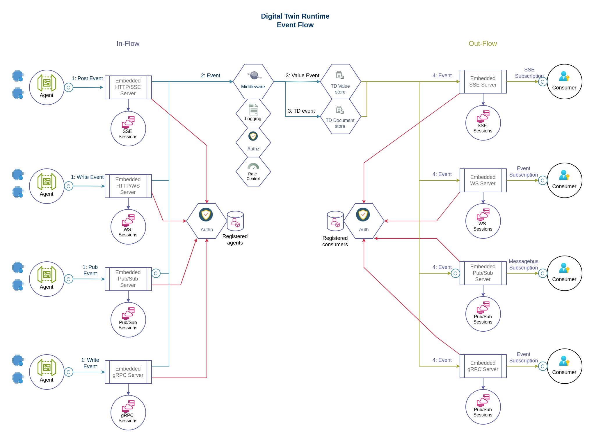
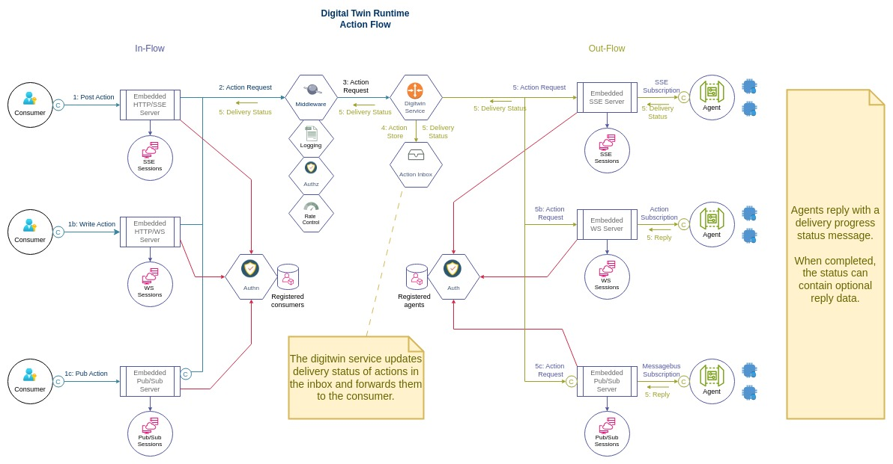

# HiveOT Digital Twin Runtime 

## Status 

The runtime is in alpha. It is functional but breaking changes can be expected.

Todo phase 1 - refactor digital twin design  

3. How to implement the safe-action (stateless) flow and track progress?
   Safe actions are stateless and return output based on the provided input.
   Multiple safe actions can be in progress concurrently.
   They are marked in the action affordance with the 'safe' flag?
   * 'safe' actions are not stored in the digitwin history?
   * The digitwin runtime forwards requests immediately to the Exposed Thing, and returns the output in the same request. Eg, rpc style.
   * Actions progress is not tracked. They are done on return.
   * A rate limit can be applied by middleware.
   
4. How to implement the unsafe-action flow and track progress.
   Unsafe actions affect the Thing state. 
   Requests must be applied sequentially.
   1. A consumer sends an action request to digitwin
   2. Digitwin checks if there is already an ongoing action with this name
      3. If an action is pending (not yet delivered) it is replaced
      4. If an action is delivered - the request is rejected with reason
      5. If an no action is pending, it is stored and forwarded. The response is returned to the consumer.
         6. if agent is not reachable, status is pending. 
         7. if agent is reachable it processes the request the response is returned and returned.
            8. agent returns 'applied', 'completed', 'rejected'
      9. Digitwin updates the corresponding property
      10. Optionally agent updates the corresponding property

5. When to use events vs properties? (option 2 - consumer centric)
   * Properties are used to report persistent state (eg: there is always a state).
     * Configurations are writable properties. They are manager focused.
     * Immutable information are read-only properties. They are informational.
   * Things that don't have internal state are always events. There is no state to present as property. 
     * Motion detection trigger is an event but not a property.
     * A doorbell trigger is an event but not a property.
   * Consumer interaction are events. 
     * Alarms are always events.
     * Sensor updates are events as they are consumer focused. They can also be properties if they represent internal state. In this case they have the same name. 
     * An actuator state change is an event as it is consumer focused. It can have a property to show the current actuator state.
     * events are recorded in the history store
   * Operators can do everything they need to do with events and actions 
     * The last event value is available in digitwin
   * The difference is intended purpose. Technically you can do everything with properties but that isn't the point.
   * Most events have corresponding properties. These should have the same name.
   * Properties don't replace event history. If it isnt state it isn't a property. 
   * The decision is up to the Thing agent

6. When to use actions vs properties?
   If it is a consumer control related to the purpose of the thing, then it is an action.  
     * Triggering an actuator is an action (lights, blinds, etc)
     * Setting configuration is done with writable properties
   * Properties can be used to indicate the progress of the action
   * If it is not idempotent (same changes, different outcome) it is an action.
   * Light/dimmer switch is a consumer action so an action.
   
7. How is action state stored in properties by digitwin?
   The state affected by actions are available through properties.
   A: Managed by the digitwin runtime. 
      * action properties are objects containing:
      * current value, progress, timestamp, pending request input, error
      * progress follows a state machine: ready - pending - applied - rejected
      * If an exposed thing defines properties with action names they are replaced.
      pro: consistent presentation and behavior for consumers
      con: depends on agent to update the state machine. open to failure
   B: Managed by the exposed thing
      pro: more accurate representation?
      con: repeat implementation with different behavior and attributes

8a. How to track the action progress?
   stages: pending, delivered, completed, aborted, failed
   * digitwin starts with pending, upgrades to delivered when request is passed to agent; agent sends progress update message completed, failed, or in-progress.
   * use 'correlationID' to link progress update messages with the action
   * this requires a ActionStatus message type - non standard?
     * protocol binding detail?
8b. How to track property write progress?
   * not at the moment. consumer watches for property updates
      pro: no need for correlationID 
      con: exposed thing must define a property for every (unsafe) action

9. How to integrate agents with the Hub
   Agents publish TD/Event/Property/Action requests to the Hub digitwin 'agent' service. 
    * these are defined as 'agent operations'
      * op:AgentUpdateProperty
      * op:AgentPublishEvent
      * op:AgentUpdateTD
    * service actions are only authorized for agents
        + compatible with WoT
        + permissions can be controlled separately 
        + no magic (hidden) endpoints needed
        + define agent operations in digitwin agent service forms
        - agents need to know this API. How?
          * concept of agents is not specified in WoT
          * hiveot defines digitwin agent operations 
          * supported in ExposedThing implementation 

  * how do agents receive invokeaction and writeproperty requests?
    * A: The hub agent service provides a subscribe-request operation?
      * included in agent service forms
      * protocol binding implements the mechanism
        agent invokes operation and receives actions and property write requests
      + matches the update operations workflow
      + compatible with WoT TD
      + agents already need to know the agent service TD for publishing stuff
 
10. add sse as per spec

Todo phase 2 - bindings for consumed things
1. Add forms to TD for supported protocols [in progress]
2. rework IHubClient to:
   * use Forms and operations
   * connect, pub form, and sub form operations
   * support both consumed things and exposed things
3. Rework TD to handle polymorphism. Store TD in nested map and using decorator functions for accessing it.
4. re-implement SSE sub-protocol as per spec.
        * support observerproperty(ies)
        * support subscribeevent(s)
        * update consumed thing
5. Rework runtime http binding to use ssesc as a custom sub-protocol
   * add to TDs
   * config option to enable/disable
   * change to use headers for subscription
6. Add single-use sse sub-protocol - one sse connection per operation
    * add to TDs
    * config option to enable/disable
   *  use headers for subscriptions

Todo phase 2 - support exposed things
1. Add a handcrafted digitwin TD for use by exposed things to connect, authn, publish events, and subscribe to actions and property writes.
    * define operations
    * publish the digitwin handcrafted TDs just like any other TD
    * make it discoverable (see below)
2. Add discovery of hub TD
   * disco points to hub TD url
   * exposed things download hub TD and use it to publish events, td and sub actions.
2. Bindings (zwave, isy, 1-wire,...)
    * use properties to represent action status

Todo phase 3 - additional protocols
1. add websocket sub-protocol (see strawman proposal)
2. add mqtt transport protocol
3. add uds transport protocol for local plugins
4. discovery should be changed to match the WoT specifications

Todo phase 4 - improvements
1. Support dynamic TD's that only:
   * only include writable properties that the client is allowed to write based on their role.
   * include only actions that client is allowed to use based on their role.
2. Testing:
   * Improve test coverage
   * Add performance testing comparing transports

## Summary

The HiveOT runtime provides routing of events and actions between devices, services and
consumers using one or multiple transport protocols. The runtime serves digital twins of 
IoT devices to consumers, containing the device Thing Definition and state. 

The runtime includes services for messaging, authentication and authorization and 
managing digital twin instances of IoT devices and services. It contains:
* Transport manager that aggregates protocol bindings for communication with devices, services and consumers
* Authentication service authenticates connections to the transport protocols
* Authorization service for authorizing the sending and receiving of messages by authenticated clients
* HubRouter action flow handles action requests from consumers and forwards it to the actual IoT devices and services
* HubRouter events flow receives events from IoT devices and forwards it to subscribers
* HubRouter properties flow receives property updates from IoT devices and forwards them to  subscribers
* Digitwin directory service serves the inventory of available devices with their digital twin Thing Definition

The hub differentiates three types of clients: IoT agents, consumers and services. Agents are clients that can operate on IoT devices or run stand-alone, and represent one or more IoT devices. They form a bridge between the native IoT device protocol and the Hub's WoT standards. Consumers are end-users that read information from the digital twins and send action requests to the digital twins. Services can act as agents and consumers.
Services enrich information received from the digital twin devices and publish the results.

The digital twin part of the runtime is designed using the W3C WoT standards and
handles Thing Description Documents, events, actions and properties.

### Events
Event messages follow a publish/subscribe approach. Thing agents publish events while consumers subscribe to Thing events. Each can use their own protocol binding.

The general event flow is:
> thing -> agent -> transport protocol -> [digital twin outbox]
>   [digital twin outbox] -> transport protocols -> subscribers

Events delivered by Thing agents are stored in the digital twin's outbox. There is no reply other than the confirmation the event is received by the Hub.

The outbox retains events until they expire which can vary between immediately to years. 

Consumers can request the latest event and property values of a Thing from the outbox.

### Actions
Actions are messages targeted at a specific Thing or service. Consumers publish action requests while agents receive these requests. Each can use their own protocol binding.

The general action delivery flow is:
> consumer -> transport protocol -> [digital twin inbox]
>   [digital twin inbox] -> transport protocol -> agent -> Thing
> 

Agents send a status update when actions are applied and completed:
> Thing -> agent -> transport protocol -> [digital twin inbox]
>   [digital twin inbox] -> transport protocol -> consumer

Action requests are delivered by the transport protocol binding to the digital twin inbox for the targeted Thing. Action requests always return with a delivery status containing the delivery progress and possibly a reply value. The action flow can hold one of the following delivery status values: 
* pending   - the action is received by the hub, placed in the outbox, but not yet delivered to the thing agent 
* delivered - the action request is delivered to the Thing agent but not yet applied
* waiting   - the action is waiting to be applied by the agent, eg device is asleep or offline
* applied   - the action was applied but result is waiting for confirmation
* completed - the action was applied and result is available
* failed    - unable to deliver the action to the agent or Thing

The action request goes through two flows, the delivery flow and the return flow:
Steps of the delivery flow:
1. Consumer sends an action request via its transport protocol.
2. The transport protocol passes it to the digitwin inbox.
3a. If the agent is reachable, the request is forwarded to the protocol binding that delivers it to the agent. The request returns with the status 'delivered'.
3b. If the agent is not reachable, the request returns with the status 'pending'.
4. When an agent connects then the inbox is notified who passes pending requests to the agent and updates the delivery status to 'delivered'.

Steps of the return flow:
1. When the action for a Thing is applied and immediate feedback is received, the status message 'completed' is sent to the digital twin inbox, containing the result value if applicable. 
2. If the action is applied by the agent and no immediate feedback is received then the delivery status message 'applied' is sent by the agent to the digital twin inbox.
3. If apply the action to the Thing fails, then a delivery status message completed is sent  by the agent to the digital twin inbox, containing the error message. This is a considered a successful delivery. Unfortunately it didn't work, hence the error.
4. If the action cannot be applied because the Thing is offline or sleeping then the delivery status 'waiting' is sent with a reason code of 'sleeping' or 'offline'.
   4a. If waiting is not supported by the agent then the agent can send a failed status update and the consumer will have to send a new request.
   4b. If the action expires before being applied then the agent drops the action and sends the failed status update with an error message describing it has expired.
   4c. Once the Thing is reachable, the action is applied then this goes to step 2. 

Applying an action can result in a state change in the device. In this case the status change event is sent separately by the agent as described in the events section of the Thing's TDD.

When the digital twin inbox receives a status update from the agent, it is passed to the consumer that sent the request, if it is online. If the consumer is offline then the status update is not repeated. On connecting the consumer can obtain the latest values from the outbox.

## Transport Protocols

A transport protocol is an embedded server that listens for incoming connections and authenticates the client. Transport protocols can also push messages to connected clients based on their subscriptions. 

Connectionless protocols are complemented with a connection-based return channel, or a polling features. 

If a connection based return channel is available, for example using SSE with HTTPS then the client's 'connected status' is based on the return channel. For example, the HTTPS protocol binding uses SSE as a return channel. SSE sessions are used to determine if the client is connected.

If a transport protocol does not support a return channel then it can fall back to polling on a prescribed interval. If polling doesn't take place within the interval, the connection is deemed lost. Some queuing is needed in this case to bridge the time between polling. This is specific to the protocol binding. 
  

## RPC requests

Some Hub clients use RPC style requests for reading available services. An rpc request is implemented as an action for the service and waiting for delivery update event containing the response.

RPC requests are implemented client side. When a consumer sends an RPC request, the protocol client waits for a delivery update event from the Hub before returning the result. This works independently from the protocol used by the agent.

## Built-in Services

The runtime includes essential built-in services to support the digital twin:
1. Authentication service. Intended for use by transport protocols to authenticate and verify a client's identity. The service client provides an RPC interface for managing clients including agents, consumers and services.
2. Authorization service. Intended for use by transport protocols to verify the ability of clients to publish or subscribe to certain agents, depending on the client's role.
3. Digital Twin services:
   a. The directory service stores TD documents
   b. The outbox service stores and forwards Thing events received from agents
   c. The inbox service stores and forwards Thing actions sent by consumers
