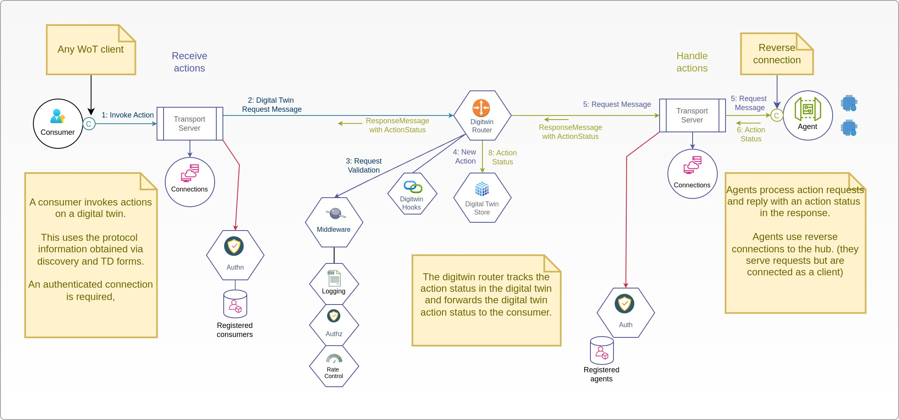

# HiveOT Digital Twin Runtime 

## Status 

The runtime is in alpha. It is functional but breaking changes can be expected.

Todo:
* authorization of subscriptions in the HTTPS/SSE transport
* digitwin directory: 
   * add forms for supported protocols (in progress)
   * support dynamic TD's that only:
      * include writable properties only if the client is allowed to write them
      * include only actions that client is allowed to use
* Transports:
  * centralized session management?
  * standard way to tracking action progress
  * support wait for action response so http clients can receive replies without events
  * http/websocket sub-protocol (see strawman proposal)
  * mqtt transport protocol 
  * nats transport protocol
  * uds transport protocol needs to be added for local services
  * discovery should be changed to match the WoT specifications
* Middleware:
  * Rate control 
  * tbd
* Testing:
  * Improve test coverage
  * Add performance testing comparing transports

## Summary

The HiveOT runtime provides routing of events and actions between devices, services and
consumers using one or multiple transport protocols. The runtime serves digital twins of 
IoT devices to consumers, containing the device Thing Definition and state. 

The runtime includes services for messaging, authentication and authorization and 
managing digital twin instances of IoT devices and services. It contains:
* Transport manager that aggregates protocol bindings for communication with devices, services and consumers
* Authentication service authenticates connections to the transport protocols
* Authorization service for authorizing the sending and receiving of messages by authenticated clients
* Digitwin inbox handles action requests from consumers and forwards it to the actual IoT devices and services
* Digitwin outbox receives events from IoT devices and forwards it to eligible subscribers
* Digitwin directory serves the inventory of available devices with their digital twin Thing Definition

The hub differentiates three types of clients: IoT agents, consumers and services. Agents are clients that 
can operate on IoT devices or run stand-alone, and represent one or more IoT devices. They form a bridge
between the native IoT device protocol and the Hub's WoT standards. Consumers are end-users that read information
from the digital twins and send action requests to the digital twins. Services can act as agents and consumers.
Services enrich information received from the digital twin devices and publish the results.

The ditgital twin part of the runtime is designed around the W3C WoT standards and
handles Thing Description Documents, events, actions and properties.

### Events
Event messages follow a publish/subscribe approach. Thing agents publish events while consumers
subscribe to Thing events. Each can use their own protocol binding.

The general event flow is:
> thing -> agent -> transport protocol -> [digital twin outbox]
>   [digital twin outbox] -> transport protocols -> subscribers

Events delivered by Thing agents are stored in the digital twin's outbox. There is no reply other than the confirmation the event is received by the Hub.

The outbox retains events until they expire which can vary between immediately to years. 

Consumers can request the latest event and property values of a Thing from the outbox.

### Actions
Actions are messages targeted at a specific Thing or service. Consumers publish action requests while agents receive these requests. Each can use their own protocol binding.

The general action delivery flow is:
> consumer -> transport protocol -> [digital twin inbox]
>   [digital twin inbox] -> transport protocol -> agent -> Thing
> 

Agents send a status update when actions are applied and completed:
> Thing -> agent -> transport protocol -> [digital twin inbox]
>   [digital twin inbox] -> transport protocol -> consumer

Action requests are delivered by the transport protocol binding to the digital twin inbox for the targeted Thing. Action requests always return with a delivery status containing the delivery progress and possibly a reply value. The action flow can hold one of the following delivery status values: 
* pending   - the action is received by the hub, placed in the outbox, but not yet delivered to the thing agent 
* delivered - the action request is delivered to the Thing agent but not yet applied
* waiting   - the action is waiting to be applied by the agent, eg device is asleep or offline
* applied   - the action was applied but result is waiting for confirmation
* completed - the action was applied and result is available
* failed    - unable to deliver the action to the agent or Thing

The action request goes through two flows, the delivery flow and the return flow:
Steps of the delivery flow:
1. Consumer sends an action request via its transport protocol.
2. The transport protocol passes it to the digitwin inbox.
3a. If the agent is reachable, the request is forwarded to the protocol binding that delivers it to the agent. The request returns with the status 'delivered'.
3b. If the agent is not reachable, the request returns with the status 'pending'.
4. When an agent connects then the inbox is notified who passes pending requests to the agent and updates the delivery status to 'delivered'.

Steps of the return flow:
1. When the action for a Thing is applied and immediate feedback is received, the status message 'completed' is sent to the digital twin inbox, containing the result value if applicable. 
2. If the action is applied by the agent and no immediate feedback is received then the delivery status message 'applied' is sent by the agent to the digital twin inbox.
3. If apply the action to the Thing fails, then a delivery status message completed is sent  by the agent to the digital twin inbox, containing the error message. This is a considered a successful delivery. Unfortunately it didn't work, hence the error.
4. If the action cannot be applied because the Thing is offline or sleeping then the delivery status 'waiting' is sent with a reason code of 'sleeping' or 'offline'.
   4a. If waiting is not supported by the agent then the agent can send a failed status update and the consumer will have to send a new request.
   4b. If the action expires before being applied then the agent drops the action and sends the failed status update with an error message describing it has expired.
   4c. Once the Thing is reachable, the action is applied then this goes to step 2. 

Applying an action can result in a state change in the device. In this case the status change event is sent separately by the agent as described in the events section of the Thing's TDD.

When the digital twin inbox receives a status update from the agent, it is passed to the consumer that sent the request, if it is online. If the consumer is offline then the status update is not repeated. On connecting the consumer can obtain the latest values from the outbox.

## Transport Protocols

A transport protocol is an embedded server that listens for incoming connections and authenticates the client. Transport protocols can also push messages to connected clients based on their subscriptions. 

Connectionless protocols are complemented with a connection-based return channel, or a polling features. 

If a connection based return channel is available, for example using SSE with HTTPS then the client's 'connected status' is based on the return channel. For example, the HTTPS protocol binding uses SSE as a return channel. SSE sessions are used to determine if the client is connected.

If a transport protocol does not support a return channel then it can fall back to polling on a prescribed interval. If polling doesn't take place within the interval, the connection is deemed lost. Some queuing is needed in this case to bridge the time between polling. This is specific to the protocol binding. 
  

## RPC requests

Some Hub clients use RPC style requests for reading available services. An rpc request is implemented as an action for the service and waiting for delivery update event containing the response.

RPC requests are implemented client side. When a consumer sends an RPC request, the protocol client waits for a delivery update event from the Hub before returning the result. This works independently from the protocol used by the agent.

## Built-in Services

The runtime includes essential built-in services to support the digital twin:
1. Authentication service. Intended for use by transport protocols to authenticate and verify a client's identity. The service client provides an RPC interface for managing clients including agents, consumers and services.
2. Authorization service. Intended for use by transport protocols to verify the ability of clients to publish or subscribe to certain agents, depending on the client's role.
3. Digital Twin services:
   a. The directory service stores TD documents
   b. The outbox service stores and forwards Thing events received from agents
   c. The inbox service stores and forwards Thing actions sent by consumers
